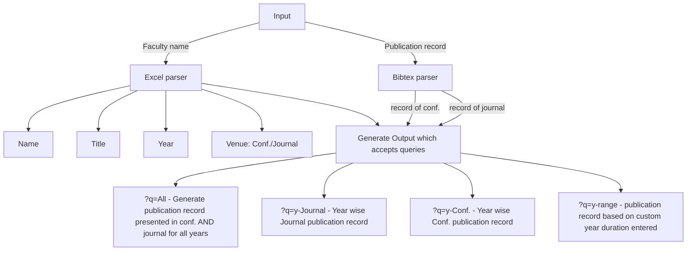

## This is a project for SIH2024
If you can see this then the repo is public and our submission was rejected.
## Installation 
Download the zip file from the release section and extract it 
### How to Run
run the app.py using 
```bash
python3 app.py
```
### Dependency

## Credits
<will add your account usernames later.>

## How the app works?

