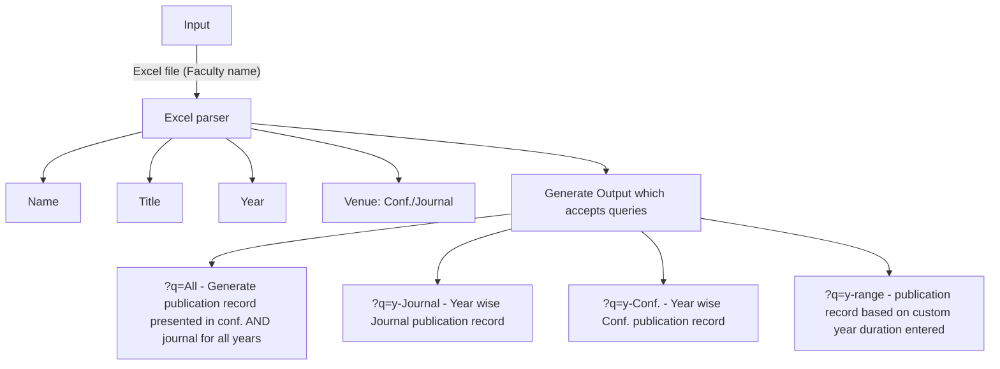

## This is a project for SIH2024
If you can see this then the repo is public and our submission was rejected.
## Installation 
Download the zip file from the release section and extract it 
### How to Run
Run the app.py using 
```bash
python3 app.py
```
### Dependency
This application uses Flask framework.
```bash
pip3 install flask pandas scholarly requests python-docx openpyxl
```

## What is the project?
This application allows you to upload a Excel file which contains names of authors in the first column with the title author_nm.


## How can you contribute?
Upload this on [pypl](https://search.brave.com/search?q=publishing+flask+application+in+pypi&source=desktop&summary=1&conversation=6dd59959fd93f09fb173cc) so you can install the project from pip3.

## Credits
@San, @kay, @chandinivasana, @Deepikat11
